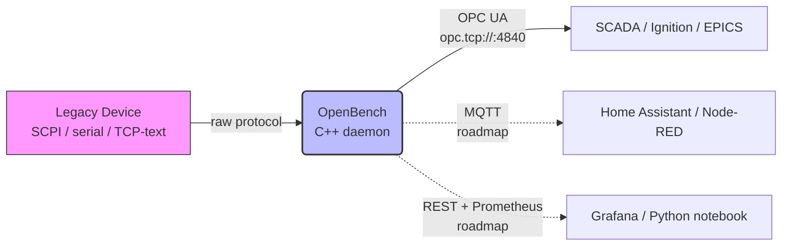

# OpenBench

> **Plug-and-play for legacy lab benches.** A small C++17 daemon that
> bridges your SCPI / serial / TCP-text instruments to OPC UA, MQTT,
> and modern observability stacks — configured by YAML, no code.

[](https://www.gnu.org/licenses/agpl-3.0)
[](https://en.cppreference.com/w/cpp/17)
[](https://opcfoundation.org/about/opc-technologies/opc-ua/)

---

## About OpenBench

Every electronics lab, university research group, and hardware startup
has the same hidden problem: an old multimeter, oscilloscope, or power
supply that works perfectly but speaks an obsolete language. To get its
data into Grafana, InfluxDB, a Python notebook, or a SCADA dashboard,
you write the same Python script that every other engineer has written
for the last twenty years. That script dies with the project.

**OpenBench fixes this once.** Describe your instrument in a YAML file.
OpenBench connects, translates in real time, and republishes the
readings to OPC UA (the industrial standard), MQTT (the IoT standard),
and your preferred dashboard, all at once. One small daemon, one
config file. The lab bench becomes a first-class citizen of the modern
data world.

And because the underlying engine is generic, the same daemon also
handles your Arduino sensor at home, your old Modbus PLC in a small
workshop, or the serial energy meter in your building. **One tool that
grows with you from grad school to factory floor.**

---

## Is this for me?

- **Hobbyist with an Arduino or serial sensor** → your readings show up
  in Home Assistant or a Grafana dashboard within minutes.
- **Grad student with a benchtop multimeter** → your thesis data
  streams into a Jupyter notebook in real time, no `pyvisa` script
  required.
- **Small factory with a 2010 Modbus PLC** → joins a modern OPC UA
  SCADA without buying a commercial gateway.
- **Building manager with serial energy meters** → your Grafana
  dashboard is up tonight.
- **R&D team prototyping new hardware** → ships with a modern API on
  day one.

Same daemon. Same YAML schema. Same `docker compose up` command.
Different YAML for each device class.

---

## Why not just use [X]?

OpenBench occupies a specific niche. The honest comparison:

| Tool | What it does well | Why OpenBench still has a place |
|------|------------------|-------------------------------|
| **[EdgeX Foundry](https://www.edgexfoundry.org/)** | Enterprise-grade IoT edge platform, many protocols | Heavy (>1 GB RAM), industrial-only, no native SCPI support — overkill for a lab bench |
| **[EMQ Neuron](https://github.com/emqx/neuron)** | Excellent industrial connectivity (Modbus, S7, OPC UA) | Industrial-focused; no SCPI/VISA/USBTMC drivers; open-source dashboard is in maintenance-only mode |
| **[ThingsBoard Gateway](https://github.com/thingsboard/thingsboard-gateway)** | Mature multi-protocol gateway | Tied to the ThingsBoard platform; Python-heavy; not standalone |
| **[PyVISA](https://github.com/pyvisa/pyvisa)** | The de-facto VISA wrapper for SCPI/GPIB/serial | A *library*, not a service — you still write Python per device, no daemon, no multi-sink output |
| **[Node-RED](https://nodered.org/)** | Visual flow editor, huge community node ecosystem | Requires drawing per-device flows; no declarative config you can put in version control |
| **[Telegraf](https://www.influxdata.com/time-series-platform/telegraf/)** | Excellent metrics collection with OPC UA & Modbus plugins | Metrics-focused; no SCPI input; not designed to bridge legacy protocols |
| **[EPICS](https://epics-controls.org/) / [Tango Controls](https://www.tango-controls.org/)** | Full distributed control systems used at particle accelerators | Powerful but heavy; weeks of learning curve; overkill for a single bench |

OpenBench is the only tool that treats a lab bench like a first-class
citizen *and* speaks OPC UA cleanly enough for industrial users to
adopt. When you outgrow OpenBench, EPICS/Tango are waiting — and
OpenBench's OPC UA output can feed both via
[EPICS-open62541](https://github.com/ISISComputingGroup/EPICS-open62541).

---

## Quickstart

Requires Docker, Docker Compose, and git.

```bash
git clone --recurse-submodules \
  https://github.com/KaranSinghDev/Legacy-Hardware-Integration-Gateway.git
cd Legacy-Hardware-Integration-Gateway
docker compose up --build
```

You should see two containers come up:

- `legacy-device` — a Python simulator pretending to be a benchtop
  power supply on TCP port 9999.
- `gateway` — the OpenBench C++ daemon, which connects to the
  simulator and exposes a live OPC UA server on `opc.tcp://localhost:4840`.

Verify with any OPC UA client (e.g. [UaExpert](https://www.unified-automation.com/products/development-tools/uaexpert.html)
or the included Python benchmark):

```bash
pip install -r benchmark/requirements.txt
pytest -v -s benchmark/test_gateway.py
```

---

## Architecture



**Solid arrows** = available in v0.1.0. **Dashed arrows** = planned
in v0.2.0 / v0.3.0.

- `src/legacy_client.cpp` — TCP client that talks to the legacy device.
- `src/opcua_server.cpp` — open62541 wrapper exposing the OPC UA endpoint.
- `src/main.cpp` — state-aware reconnect loop that ties them together.
- `sim/legacy_device.py` — Python simulator (SCPI-flavoured TCP server).
- `benchmark/` — pytest + asyncua integration tests.

The build is CMake-driven; `open62541` is included as a git submodule
at `third_party/open62541` and statically linked.

---

## Current status — v0.1.0

This is the **pre-feature snapshot**. The binary today exposes one
hardcoded `Voltage` node over OPC UA, driven by a Python SCPI-flavoured
simulator on TCP. It does the OPC UA half of the bridge cleanly and
reliably — the right foundation to build the YAML-driven, multi-sink
gateway on top of.

The full roadmap:

- **v0.2.0 — Lab-first MVP**: YAML-driven device profiles, generalized
  SCPI/TCP transport, MQTT + REST sinks, realistic Keysight 34461A
  simulator, end-to-end Grafana demo.
- **v0.3.0 — Credible product**: USBTMC + serial + Modbus transports,
  Prometheus sink, structured logging, OPC UA authentication, plugin
  architecture for community-contributed drivers.

If you want to follow along or contribute, see
[CONTRIBUTING.md](CONTRIBUTING.md).

---

## Quality gates

Every push and PR runs through a three-stage CI pipeline
(`.github/workflows/ci.yml`):

1. **Code quality** — `clang-format`, `black`, `flake8`, and full
   `cppcheck` static analysis. Must pass before anything else runs.
2. **Memory safety** — full AddressSanitizer build to catch leaks
   and undefined behavior at compile time.
3. **Integration benchmark** — `docker compose up`, then a real
   `pytest` + `asyncua` suite that asserts connectivity, freshness,
   sub-100 ms read latency, and >200 reads/second throughput against
   a live OPC UA endpoint.

---

## License

OpenBench is licensed under the **GNU Affero General Public License
v3 or later (AGPL-3.0-or-later)**. The full text is in
[LICENSE](LICENSE). Third-party attributions are in [NOTICE](NOTICE)
and [THIRD-PARTY-NOTICES.md](THIRD-PARTY-NOTICES.md).

The AGPL is a strong copyleft license: any modified version that is
made available to users over a network (including SaaS deployments)
must publish its source code under the same terms. This protects
contributors against silent commercial re-use of their work while
still allowing anyone to study, run, modify, and share the code.

If you would like an alternative license for a specific use case,
please reach out via the contact below.

## Citation

If you use OpenBench in academic work, please cite it via the
[CITATION.cff](CITATION.cff) file at the repository root. GitHub will
render a "Cite this repository" widget on the project sidebar
automatically.

## Authors

See [AUTHORS](AUTHORS) for the canonical contributor list.

Copyright (c) 2026 Karan Singh.

## Contact

Issues and feature requests: please open a
[GitHub issue](https://github.com/KaranSinghDev/Legacy-Hardware-Integration-Gateway/issues).

Direct contact: karansingh25822@gmail.com
